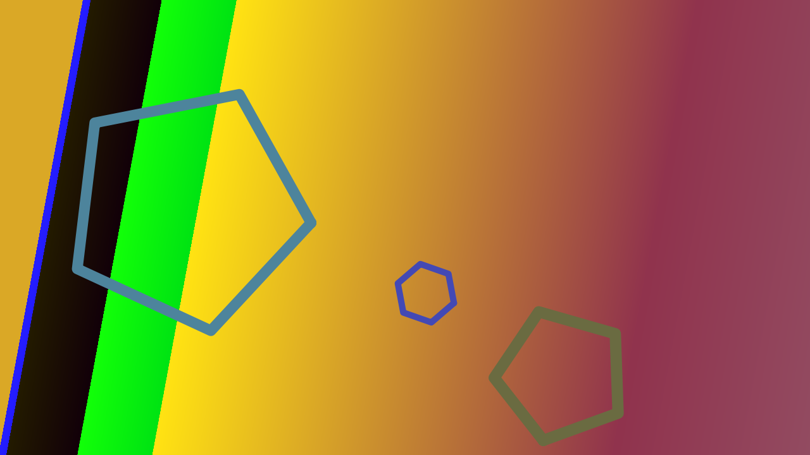
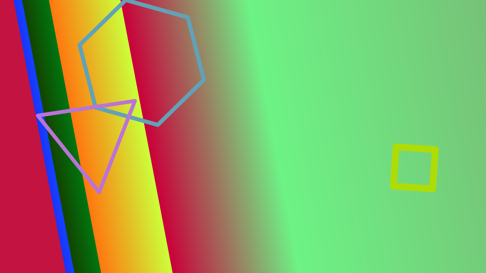

# artgen

## about

artgen makes ephemeral art for your enjoyment (or not). it makes it easy to generate some random art and then display it to an enduser. It could also be used to make larger art than it does by default (720p) at the cost of more time/resources.

## usage

artgen is simple to use. you can use html templates to serve the image:
```go
import "github.com/sharkpick/artgen"

func handleArtgen(w http.ResponseWriter, r *http.Request) {
    p := artgen.NewPainting() // returns a *Painting, ready to generate
    p.Generate() // generates and saves the image
    defer p.Cleanup() // destroy image after serving
    fmt.Println(p.File()) // shows location of the file
    if t, err := template.ParseFiles(templateFile); err != nil {
        // ... handle error 
    } else {
        t.Execute(w, p)
        // inside your template you can find the base64 encoded image in {{ .Image }}
    }
}
```

or change the workspace and write it to an existing directory of your choice
```go
// generate 10 random images
func main() {
    myNewWorkspace := "./"
    for i := 0; i < 10; i++ {
        p := artgen.NewPainting(myNewWorkspace)
        p.Generate()
        // DO NOT Cleanup() here or your images will also be deleted.
    }
}
```

you can also change the size of the end product. you must set your desired result before running Generate()
```go
func main() {
    width, height := 1920, 1080
    for i := 0; i < 10; i++ {
        p := artgen.NewPainting()
        p.SetWidth(width)
        p.SetHeight(height)
        // p.SetDimensions(width, height) // or do both
        p.Generate()
        defer p.Cleanup()
        // do work
    }
}
```

you can also use JPGs instead of PNGs when speed matters. default quality for artget.JPG is 75% but can be adjusted before running Generate().

```go
func main() {
    p := artgen.NewPainting()
    p.SetFormat(artgen.JPG)
    p.SetQuality(50)
    p.Generate()
    defer p.Cleanup()
}
```

## samples

artgen uses some randomness to make fun images like the below. 



